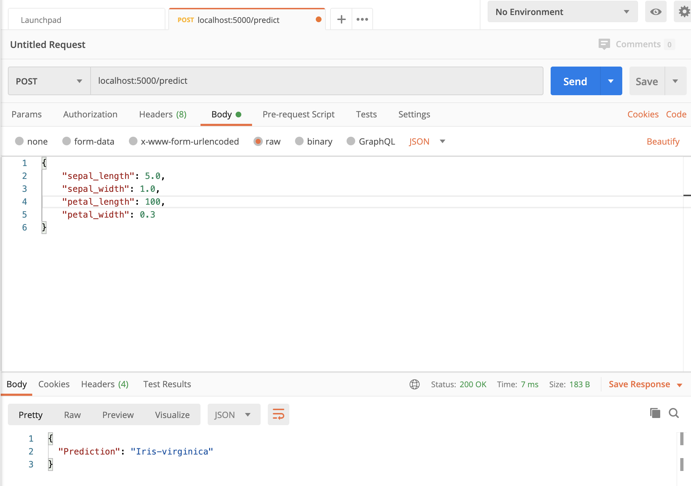

# Flask app for ML deployment
Deploy a ML model as a Flask app.

This follows the tutorial at [https://towardsdatascience.com/deploy-your-machine-learning-model-as-a-rest-api-4fe96bf8ddcc](https://towardsdatascience.com/deploy-your-machine-learning-model-as-a-rest-api-4fe96bf8ddcc)

